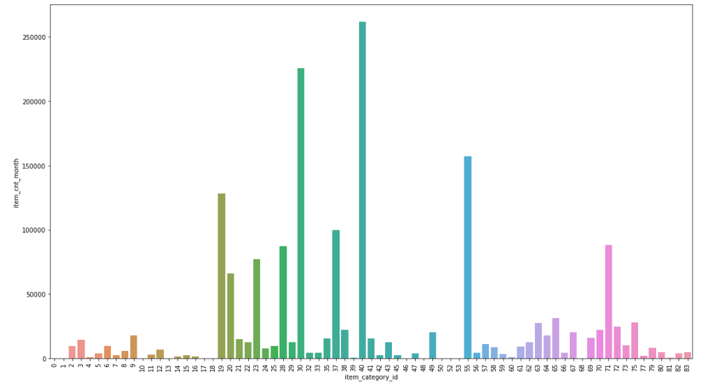
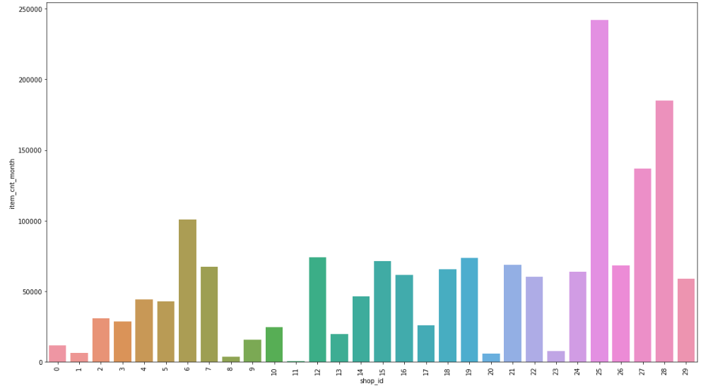

# sales_forecast
A web app for forecasting sales given historical data

# Table of contents
- [Project Definition](#project-definition)
- [Installation](#installation)
- [Usage](#usage)
- [Web Application](#web-application)
- [Project structure](#project-structure)
- [Data](#data)
- [Data analysis and modelling](#data-analysis-and-modelling) 
- [Author](#author)
- [Credits](#credits)
- [Requirements](#requirements)

# Project Definition
A web application that predicts sales volumes (number of items sold) next month based on historical data.  
You can try it here: https://sales-volumes-forecast.herokuapp.com  
This potentaially could be interesting to small/medium business owners in retailing to help them plan their supply better. 
Machine Learning has technologies for such task for a long time, but in many cases using them requires buying expensive software solustions or hiring a team of analysts. 
A good forecasting tool would automize the tedious process of planning for the next month and also improve guess-based forecasts by using data science instead. 

# Installation
1. In order to deploy the app locally please download from Github: `git clone https://github.com/alibekU/sales_forecast` and go to the new `sales_forecast` folder
2. You may want to set up a new virtual environment: `python3 -m venv virtual_environment_name`  and activate it by running `source virtual_environment_name/bin/activate`
3. Then, use pip to install all the needed packages: `pip install -r requirements.txt`

# Usage
**To deploy the web app locally:** 
After downloading, go to the the 'sales_forecast/app' folder and:  
1. **From the app/ directory** run the following command to launch your web app  
    `python run.py`
2. Go to http://0.0.0.0:3001/ in your browser

**To re-train the model:** 
Currently the web app uses app/models/forecast_best_linear.pkl model that was pre-trained on 30 shops (../models/forecast_best_linear.pkl file). 
However, if you want to create a new model and re-train it, run the following commands in the 'sales_forecast/app' directory:  
`python train_model.py ../data/sales_train.csv ../data/items.csv ../models/forecast.pkl`  
By default the re-building of the model will involve only 3 shops to save time. 
You can change invoking preprocess_data() function of app/train_model.py, specifically `use_shop_ids=range(3)` parameter to use more shops in the training, but please note that training
on a large number (like 30) of shops can take several hours to complete 

# Web Application
The app can be found at https://sales-volumes-forecast.herokuapp.com or hosted locally using the above instructions. Instructions are available on the home webpage. Here the main page for data input:
 

 
 
After running the model, the web app returns a report on how well the model performed on test data to gain user's confidence. Here is a resulting report for the template data:

# Project structure 
| data\  
|-sales_train.csv - data with sales transactions for 60 shops in 3 years from https://www.kaggle.com/c/competitive-data-science-predict-future-sales/data 
|-items.csv - data with item categories for 60 shops in 3 years from https://www.kaggle.com/c/competitive-data-science-predict-future-sales/data 

| models\  
|-forecast_best_linear.pkl - a Pickle file, saved regression model trained on 40 shops data 
|-forecast.pkl - a Pickle file, saved regression model trained on 3 shops data 

| app\  
|-run.py - the main script of Flask web app  
|-process_data.py - functions to clean, generate features and split data for predicting 
|-train_model.py - functions to train and evaluate a model. Run this file in command line to re-build a model 
|-templates\  
--|-master.html - main html page template  
--|-results.html - a template for displaying results  
|-uploads\ - folder with data uploaded by the users  
|-downloads\ - folder with data for users to download  

| images\ - pictures for the README file  

| requirements.txt - a list of required PIP packages, result of `pip freeeze` command  
| Procfile - code for Flask app launch at Heroku  
| data_exloration_v1.ipynb - a Jupyter notebook with ML pipeline exploration  
| README.md - readme file  

# Data
The training data comes from Kaggle's Predict Future Sales competition https://www.kaggle.com/c/competitive-data-science-predict-future-sales/data  

I've used a subset of the data on first 30 shops (shop ids 0 to 29) to create a training and testing data sets. 
Number of transactions (rows) is  1 353 959 
Number of shops is 30  
Number of categories is  73 
Number of unique items is  18 712 
 
Here is a summary of that data:

 
 

# Data analysis and modelling
The `data_exloration_v1` Jupyter Notebook contains the analysis and steps for creating the model used in the web application. Below you will find the sumary of it in the following structure:

1. Project Definition
2. Analysis
3. Methodology
4. Results
5. Conclusion
 

Let's begin.  
1. Project Definition:
- The goal is to predict number of items sold next month (the future) given previous sales (the past). We are predicting how many items of each item type will be sold in each of shops that are provided in the historical data. To do that, we will aggregate the transactions into montly totals, create the variable 'itm_cnt_nxt_mnth' which will hold number of items sold next month, and solve the regression problem of predicting 'itm_cnt_nxt_mnth' using this month sales and statistics of past sales.
- The strategy is too select shops that will be used for training, clean and aggreagate data by month, generate several features that describe the sales in the past (trend, rolling means, category and shop historic means, etc.), split data into train and test (usually called validate data, and it will be drawn from the initially selected shops), create and train several models, select the best model based on performance on the test data, and then perfrom the final test on shops that were not originally in train/test split data (let's callthem 'unseen' shops) to make sure we have a working model.
- The expected results are that the error on test set and on 'unseen' shops are close to each other, and are lower than that of some basic estimator that a business owner might use in real life without all this fancy data science (like sales from last month or average of last 3 months, for example).
- The metric to compute the error will be mean average error (MAE from now on). The choice of MAE is based on the fact that it is most easy to understand for someone without data science background, but with the real life business needs because if we are talkng about forecasting the number of items sold, it is best to minimize the number of items we got wrong, and talk about this number with the business owners. Saying that on average we are wrong by 1 item or 10 items in each prediction  much clearer conveys the error size to the people who deal with selling these items than some other metrics that are less expressable in terms of real-world terms.
 
 
2. Analysis
 Let's briefly go over the data exploration part.
- First, clean the data. There were no missing values or transactions with negative number of items sold or negative prices in this subset of data.
- Then, aggregate daily totals for each item and shop into montly totals. Then we explore the trend and seasonality in data:

- After that, explore how number of items sold varies depending on the item, item category and shop. 
- - For the item type:

- - For the item category:

As we see from the graph, the number of items sold varies from category to category. To account for this dependency, we will create a varaiable with average amount of items sold for each category id up to each month ('category_mean_past')
- - For the shop:

As we see from the graph, the number of items sold varies from shop to shop. To account for this dependency, we will create a varaiable with average amount of items sold for each item id and shop up to each month ('shop_item_mean_past')  
  
- Then I've handled outliers by replacing them with averages for each item-shop combination each month using z-statistics.  
To identify the outliers, I groupped the data by shop and item and then calculated standard deviation, mean and z-statistics for each item in each shop. Then, if in particular month and in a certain shop we sold number of items outside of 3-std-range from mean, we call that row an outlier and replace the number of items sold with a mean for that item in that shop.  
As a result,around 0.4% of monthly totals were outliers. They could be due to human error during input or some anomalies. It is best to handle outliers to have a more stable model, so we include outlier replacement with the averages in the code of the web app.  
In the end, I sort the data by date.
 
 
3. Methodology  
The Methodology has the following structure:
- Data cleaning recap
- Feature engineering and train, test and predict split
- Creating a base estimator to compare with
- Creating and testing linear model
- Creating and testing XGBoost model
- Tuning parameters and getting feature importance for the best model
- Testing on data not from the 30 shops used for training and test (unseen shops)
- Coding complications
 
 
- Data cleaning recap:  
As mentioned in the previous analysis section, the outliers only for the contionuous variable of the number of items sold this month is handled using z-statistics by replacing data that fall out of 3-std-range from the mean with the mean. There were no missing (null) values, but if they were, I would have dropped them from the dataset as there was enough of data available. 
- Feature engineering and train, test and predict split:  
Using the finding from data exploration, we generate the mentioned features. Then, we split data into train, test, and predict using months as boundaries as we predict montly sales and do not want to mix records from different month. For the train set, we took 70% of the number of months (note that this could be different from 70% of the number of rows), for the predict set we take the last month, which is useless for training or testing in any case as it does not have information on sales next month, and the rest of the months goes to the test set. Given this split and the fact that we have 3-month-window rolling feature, the web app can take data with at least 6 month of records so that 4 months go to train, one to the predict and the one remaining month for the test set.  
In addition, as part of data processing, I've added rows with 0 number of items sold for each month-shop-item combination that did not have a record. Not having a record means that there were no sales this month, and so the system or person entering data simply omitted recording it, but for the training purposes, we need explicitly show that there were 0 sales that particular month. Moreover, doing that will ensure that for the last month we will have a complete set of all possible item-shop combinations to predict and not just whatever was sold that month.

- Creating a **base estimator** to compare with:  
In order to understand whether we did a good job with our forecast and whether anyone should bother using it, we need to compare the model with some base estimator that does not use ML and which can be easily used in real life. For that purpose, I've created a small class 'base_estimator' that has 'predict' method and can be of two types: first forecasts number of items sold next month to be equal to sales last month, and the second forecasts average of items sold during last 3 month. It turned out that the second base estimator is better, so we will be using it for comparison.  
In terms of the measuring the performance, we will be using mean average error on the number of items (MAE), as it will be easy to interpet - this is by how many items our prediction differs from the reality. The base estimator gives MAE of 0.07 on test data.

- Creating and testing **linear model**:   
Then we use default HuberRegressor (because it is known to handle outliers pretty good and our data still has quite a large standard deviation). It gives MAE of 0.06. In order to use linear model, I first analyzed linear collinearity between the created features. Here are the results:  
  
The 'item_cnt_month' and 'item_cnt_roll_mean' have high digree of correlation (0.86), however, removing the latter feature results in the performance drop. Although the correlation is high, it is not full (i.e. less than 1), and the 'item_cnt_roll_mean' gives some addtional information for the system in the cases when there is no linear correlation as the error increases with its removal.
Then, I've created a Pipeline with scaling step before applying the linear regression. This improves the performance and also makes possible to interpret coefficients as feature importance.

- Creating and testing **XGBoost model**:   
Next, I was really betting on magical XGBoost to come and save the day by giving an incredible forecast. However, it had MAE of 0.07, which is almost 16% worse than the linear regression above. Besides, XGBoost turned out to be extremely slow compared to the linear models, and this is a disadvantage for using in a web app.

- Tuning parameters and getting feature importance for the best model:  
Given that HuberRegressor turned out to be the best, I've used it along with GridSearchCV to tune its hyper parameters. Specifically, I tuned 'max_iter' and 'epsilon' parameters, both of which have changed from the default. Max_iter became 300 and epsilon became 1.3. Given that we have time series, we could not use a simple cross-validation splitting tecnique, as we should not randomly mix past and future data in train and test, but instead keep data ordered by date. To do so, there is a TimeSeriesSplit that ensures that there are no data leakages and data from past will not have access to data from the future to later use it. The tuned regressor still produced MAE of 0.06, alsmost with no improvement, but it is still better than the base estimator's MAE of 0.06.  
The most important features for predicting next month sales (with larges coefficient values) turned out to be number of items sold this month, average number of items sold last 3 month, trend for the number of items sold and how many items are sold per day on average.

- Testing on data not from the 30 shops used for training and test (unseen shops):   
Now let's test the model on shops that were not used in the initial train and test, specifically shopd 30 to 39, and part of data on shop 42 as we use it as an example template with data in the web app.  
On the 10 unseen shops MAE for the model was 5% better than MAE for the base estimator, or 0.07 vs 0.08 items.
On the template shop MAE for the model was also 5% better than MAE for the base estimator, or 0.82 vs 0.86 items.

- Coding complications:  
There were no major problems during the development except for the large amount of time it takes to process several milliong rows of data and train/test the modesl on them, especially with parameter tuning and for the XGBoost algorithm.
 
 
4. Results
It was interesting that XGBoost performed a bit worse than the Huber Regressor. This could be explained by several factors: first, the difference in the error is less than 0.01 in terms of MAE, which is not significant to begin with and could be due to a chance, second ,the number of features is not so large (9), and this could result in that a simple model is enough to capture everything from them, and it we had more features, then XGBoost or other more comlicated models would shine. The use of Huber regression in case of a web app is also justified by its performance in terms of the time it takes to create predcitions compared to the XGBoost.
 
 
5. Conclusion  
Currently the mean absolute error (MAE) on number of items sold in a month is a bit better (around 5%) then that of a base estimator. This results are OK as they can result in real better money allocation (almost 22% of the total sales volume on test data) if the user applied the forecasts on test period and bought the right amount of items. Howerer, the model tuning has not resulted in any improvement, posiible because of cv=3 to save time. I would need to try more serious parameter tuning and also other models and combination of models to improve the forecast on usneen shops.  
**Possible improvements:**  
- Model:  
- - Hyperparameter optimization with more CV splits 
- - Since only 4/9 features turned out to be sinificant, need to come up with additional features (std, max, min and etc)
- - Adding external data to make better predictions: weather and holidays  
- - Trying other models (RF, AdaBoost, etc,) and using ensemble methods and to combine several models and take output of one model as input of another 
- - Create list of items sold at each shop and add zeroes using it instead of adding all month-shop-item combinations  
- Web app:  
- - Better interface: less text, data visualization of the results, better layout and usability (clear instructions, buttons, etc.)
- - File check for the right format
- - Security for the uploaded data
- - Possibly sending forecast files through email for privacy and to be able to handle big files
- - Support of multiple users upload
- - Output data from the last month next to prediction for comparative analysis
 
 

# Author 
Alibek Utyubayev. 
 
Linkedin: https://www.linkedin.com/in/alibek-utyubayev-74402721/

 
 

# Credits
Credits to Kaggle for the collected data and to Dimitreo Liveira for starting ideas on ML analysis https://www.kaggle.com/dimitreoliveira/model-stacking-feature-engineering-and-eda

 
 

# Requirements
The Jupyter Notebook uses standard Anaconda installation  
The web app has following requirements:  
click==7.1.2
Flask==1.1.2
gunicorn==20.0.4
itsdangerous==1.1.0
Jinja2==2.11.2
joblib==0.17.0
MarkupSafe==1.1.1
numpy==1.19.3
pandas==1.1.4
plotly==4.12.0
python-dateutil==2.8.1
pytz==2020.1
retrying==1.3.3
scikit-learn==0.23.2
scipy==1.5.3
six==1.15.0
sklearn==0.0
threadpoolctl==2.1.0
Werkzeug==1.0.1
xgboost==0.90
xlrd==1.2.0
xlwt==1.3.0