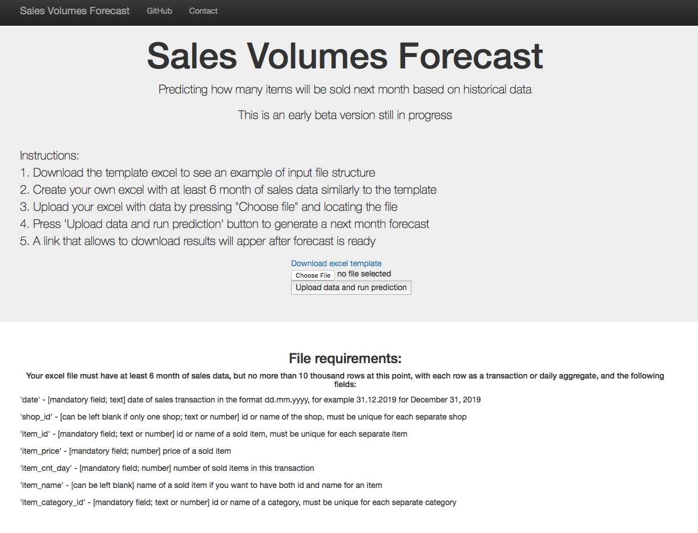

# sales_forecast
A web app for forecasting sales given historical data

# Table of contents
- [Purpose](#purpose)
- [Installation](#installation)
- [Usage](#usage)
- [Web Application](#web-application)
- [Project structure](#project-structure)
- [Data](#data)
- [Modelling](#modelling) 
- [Discussion of the results](#discussion-of-the-results)
- [Author](#author)
- [Credits](#credits)
- [Requirements](#requirements)

# Purpose
A web application that predicts sales volumes (number of items sold) next month based on historical data.  
This potentaially could be interesting to small/medium business owners in retailing to help them plan their supply better. 
Machine Learning has technologies for such task for a long time, but in many cases using them requires buying expensive software solustions or hiring a team of analytics. 
A good forecasting tool would automize the tedious process of planning for the next month and also improve expert-based forecasts using data science. 

# Installation
1. In order to install the code and deploy the app locally please download from Github: `git clone https://github.com/alibekU/pipsales_forecast`.
2. You may want to set up a new virtual environment: `python3 -m venv /path/to/new/virtual/environment` 
3. Then, use pip to install all the needed packages: `pip install -r requirements.txt`

# Usage
**To deploy the web app locally:** 
After downloading, go to the the 'sales_forecast/app' folder and:  
1. **From the app/ directory** run the following command to launch your web app  
    `python run.py`

2. Go to http://0.0.0.0:3001/

**To re-train the model:** 
Currently the web app uses app/models/forecast_v1.pkl model that was pre-trained on 40 shops. 
However, if you want to create a new model and re-train it run the following commands in the 'sales_forecast/app' directory.  
Note that by default the model will be trained on 3 shops to save time. 
Please note it will take 3-4 hours to train on 40 shops. 
To run pipeline that cleans data and trains the model run this command from app/ directory 
        `python train_model.py ../data/sales_train.csv ../data/items.csv ../models/forecast.pkl`

# Web Application
The app can be hosted locally only now.

 
Instructions:
1. Download the template excel to see an example of input file structure (more on that below) 
2. Create your own excel with at least 6 month of sales data similarly to the template excel 
3. Upload your excel with data by pressing "Choose file" and locating the file 
4. Press 'Upload data and run prediction' button to generate a next month forecast
5. A link that allows to download results will apper after predicting is complete 

# Project structure 
data\  
-sales_train.csv - data with sales transactions for 60 shops in 3 years from https://www.kaggle.com/c/competitive-data-science-predict-future-sales/data 
-items.csv - data with item categories for 60 shops in 3 years from https://www.kaggle.com/c/competitive-data-science-predict-future-sales/data 
models\  
-forecast_v1.pkl - a Pickle file, saved regression model trained on 40 shops data 
-forecast.pkl - a Pickle file, saved regression model trained on 3 shops data 
app\  
-run.py - the main script of Flask web app  
-process_data.py - functions to clean, generate features and split data for predicting 
-train_model.py - functions to train and evaluate a model. Run this file in command line to re-build a model 
-templates\  
 --master.html - main html page template  
 --resulst.html - a template for displaying results  
 -uploads\ - folder with data uploaded by the users  
 -downloads\ - folder with data for users to download  
images\ - pictures for the README file  
requirements.txt - a list of required PIP packages, result of `pip freeeze` command  
Procfile - code for Flask app launch at Heroku  
data_exloration_v1.ipynb - a Jupyter notebook with ML pipeline exploration  
README.md - readme file  

# Data
The training data comes from Kaggle's Predict Future Sales competition https://www.kaggle.com/c/competitive-data-science-predict-future-sales/data  

Number of transactions is 1820364  
Number of shops is 40  
Number of categories is 74  
Number of unique items is 19111  

 
We can see from the summary that the number of items sold per month on average (item_cnt_month) is less than 3. This could be challeinging if we would later try to predict on shops with high amount of sales. We might want to multiply some of the shops sales by some factor to generate data that will be useful in such cases.

# Modelling
The model that was used for forecasting is XGBoost regressor as it showed the best results in terms of mean absolute error (MAE) of 0.8 (items/month) compared to Linear Regression (MAE of 1.8 on test data) and Random Forest (MAE of 1.2 on test data).  
In the code I currently use I am not performing grid search parameter optimization as it takes several our to train the model without it, but in the future I plan to use less data and try to optimize the model. 
On the models that used less data (3 shops) I ran grid search parameter optimization with the following parameters:  
`parameters = {  
                "max_depth"        : [ 1, 3],  
                "min_child_weight" : [ 7, 10],  
                "gamma" : [0, 1, 3],  
                "learning_rate" : [0, 0.3, 0.7]  
    }`  
of which only min_child_weight turned out to be different from the default parameters and became 10.  
In the modelling process I predict sales for the next month as the target variable.  
I've added various feature that show how each shop, item and category have historically performed.  
Since we are dealing with a timeseries, the features that can calculated across the whole time series using sales of the next month (mean of future sales across all the shops or mean acrros the months, for example) we should avoid calculating them on test data set as it will be considered data leakage and give away information on the future sales that could be used by the model. To avoid the issue, I've calculated these values only on train data set and then assigned them to the test data so that we can use the features based on next-month sales but only in terms of the history.  
The most important features turned out to be category-grouped mean number of items sold next month, month-grouped mean number of items sold next month and shop-grouped mean number of items sold next month.

# Discussion of the results
Currently the mean absolute error (MAE) on number of items sold in a month is around 0.8 on test data that was derived from the 40 shops in the train data.  
When testing on 10 shops that were not used in training, MAE is 1.2. While testing on one unseen shop with only 6 month of data the MAE is 1.96. Given that the average of items sold per month is 2, this is not a small number. This demonstrates that for better predictions we need more data in terms of the shops and time period. This suggests that trying to predict sales with this app for a single shop that has only a couple month of data will not be a good idea 
Another thing is that to really see the accuracy of the prediction it would be better to have more broad data sets with sales of large amount of items. Currently this results imply that we should use the model on data with large amounts of sales (groceries, for example) with cautious as the error can be much bigger in terms of the number of items.
I will be working on imporoving accuracy of prediction.  
**Possible improvements:**  
Web app:  
1. Better interface
2. File check for the right format
3. Security for the uploaded data
4. Possibly sending forecast files through email for privacy
5. Support of multiple users work
6. Output data from the last month next to prediction for comfort
 
Model:  
1. Hyperparameter optimization with less data to speed up training initially  
2. Hyperparameter optimization with CV split based on date instead of random as we are dealing with time series  
3. Training on more diverse data that will have more items sold or generating such data from this data  
4. Adding external data to make better predictions: weather and holidays

# Author 
Alibek Utyubayev. 
 
Linkedin: https://www.linkedin.com/in/alibek-utyubayev-74402721/

# Credits
Credits to Kaggle for the collected data and to Dimitreo Liveira for starting ideas on ML analysis https://www.kaggle.com/dimitreoliveira/model-stacking-feature-engineering-and-eda

# Requirements
click==7.1.2
Flask==1.1.2
gunicorn==20.0.4
itsdangerous==1.1.0
Jinja2==2.11.2
joblib==0.17.0
MarkupSafe==1.1.1
numpy==1.19.3
pandas==1.1.4
plotly==4.12.0
python-dateutil==2.8.1
pytz==2020.1
retrying==1.3.3
scikit-learn==0.23.2
scipy==1.5.3
six==1.15.0
sklearn==0.0
threadpoolctl==2.1.0
Werkzeug==1.0.1
xgboost==0.90
xlrd==1.2.0
xlwt==1.3.0